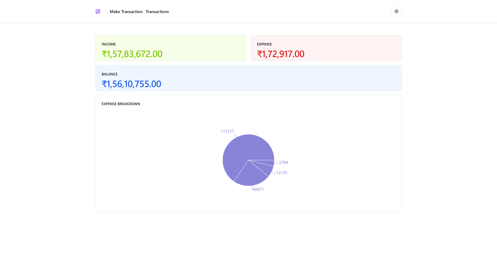
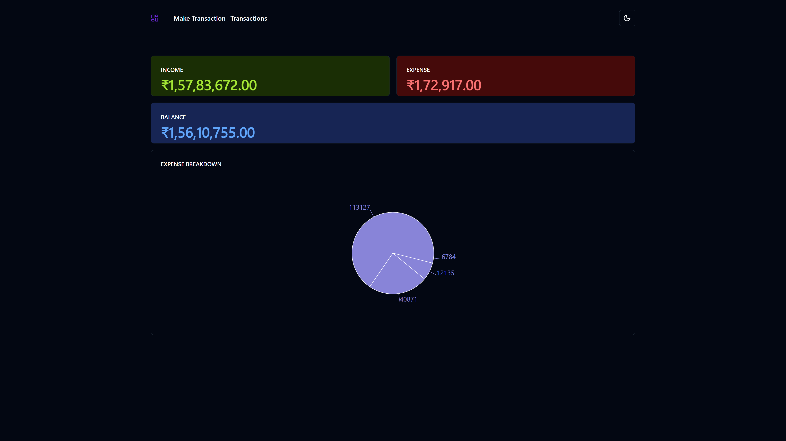
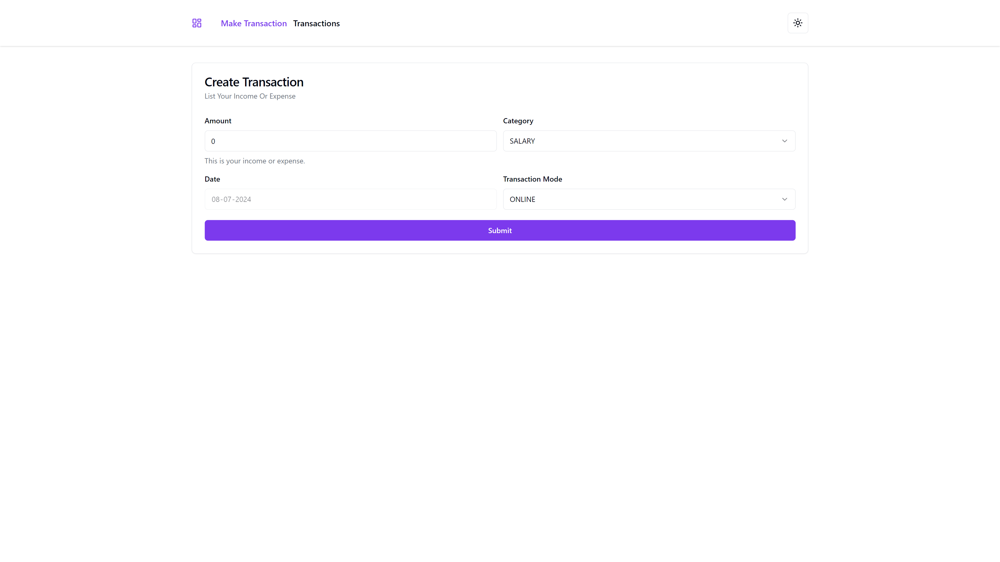
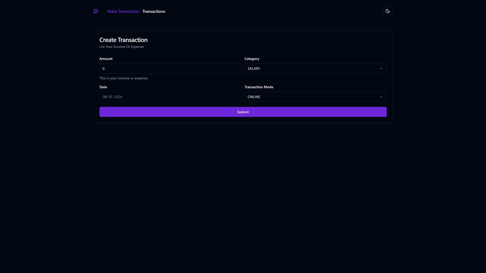
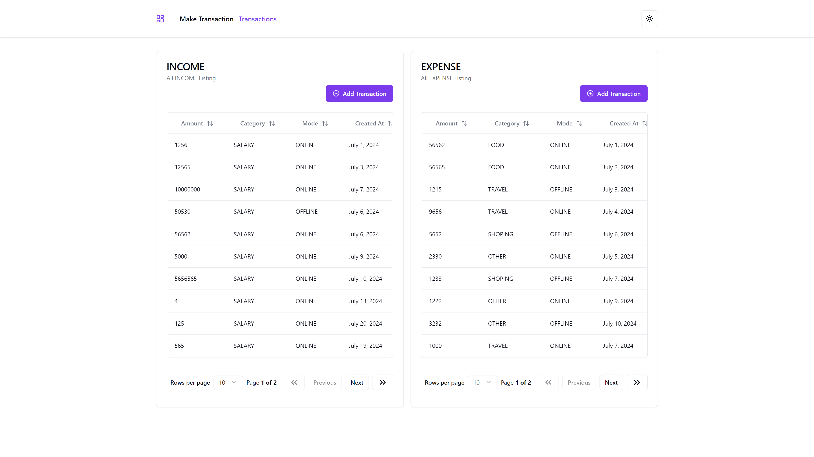
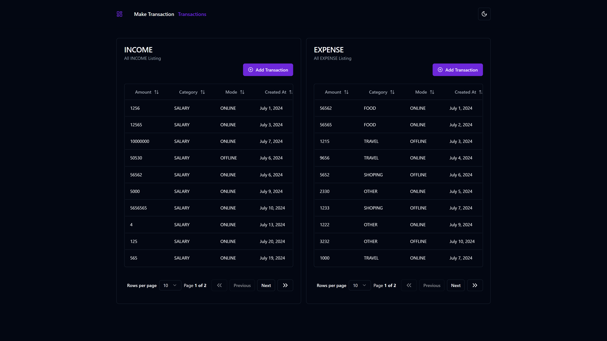
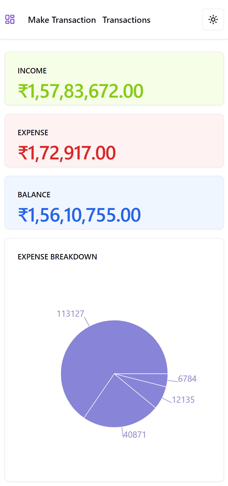
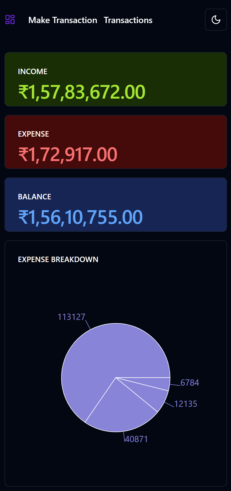
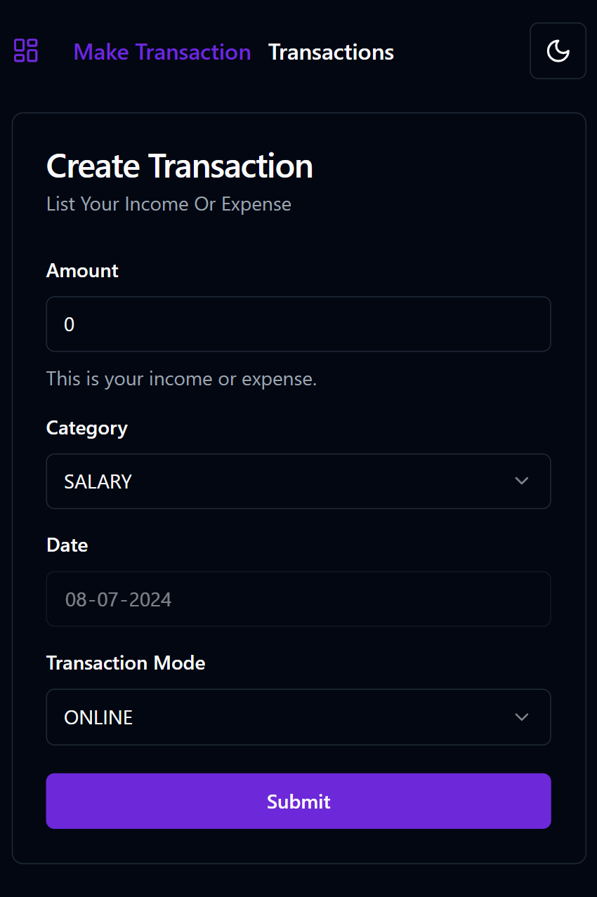
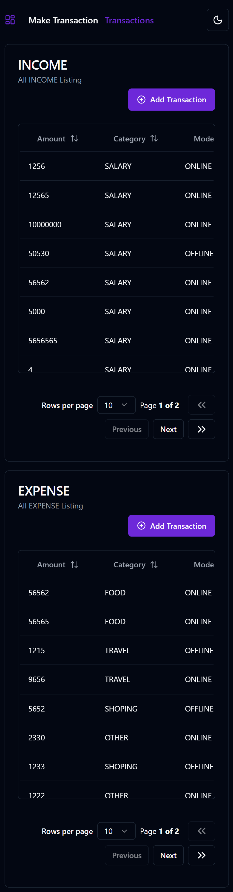

# Expense Tracker App
- This app allows user to track their income and expenses, categorize them, and display summary statistics.

## How to run:
Download and open the zip file and hit `npm install` to install all the dependencies hit `npm run dev` to start the client server and `npm run dev:server` on different terminal to run json server.

| Steps      | with [npm](https://www.npmjs.com/) |
| -----      | ---------------------------------- |
| Install    | `npm install`                      |
| dev        | `npm run dev`                      |
| dev:server | `npm run dev:server`               |

## App User Interface for Desktop and Tablet

### Home Page (Light Theme)

### Home Page (Dark Theme)

### Transaction Form Page (Light Theme)

### Transaction Form Page (Dark Theme)

### Transactions Listing Page (Light Theme)

### Transactions Listing Page (Dark Theme)

## App User Interface for Mobile Devices

### Home Page (Light Theme)

### Home Page (Dark Theme)

### Transaction Form Page (Dark Theme)

### Transactions Listing Page (Dark Theme)

